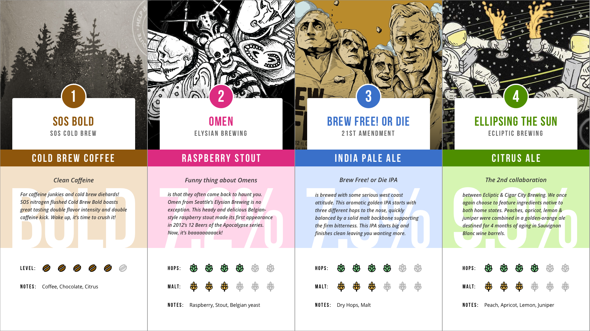

# tapdat



## Synopsis

tapdat is a digital tap list application, powered by [Contentful](https://www.contentful.com).

## Features
* Built on top of the [Yeoman Webapp Generator](https://github.com/yeoman/generator-webapp)
* Includes Gulp / Sass / Handlebars
* Built to consume [Contentful](https://www.contentful.com) APIs

## Development
See the [Trello board](https://trello.com/b/cbClnWYD/tapdat) for current design and development tasks.

Periodic builds will be deployed to [tapdat.rjlacount.com](http://tapdat.rjlacount.com).

## Installation

### Contentful

* Create a [Contentful](https://www.contentful.com) account and empty space
* Example content for tapdat is in [resources/contentful-export.json](resources/contentful-export.json) and can be imported using the [Contentful importer](https://www.contentful.com/developers/docs/tutorials/general/import-and-export/#importing-content)

### Configuration

* Before running the app, you'll need to create your own `config.js` including your Contentful Access Token, Space ID, and number of taps in your setup. This file is not tracked, to keep API keys private.

`app/scripts/config.js`
```language-javascript
var myAccessToken = 'your-token',
    mySpaceId = 'your-space-id',
    tapCount = 4;
```

### Running the app

* Run `gulp serve` to preview and watch for changes
* Run `gulp` to build your webapp for production

## Contributors

Just let me know if you'd like to contribute!

## License

Licensed under the [GPL 3.0](http://www.gnu.org/licenses/gpl.txt). You are encouraged to link back to [my web site](http://rjlacount.com), and/or [this GitHub repository](https://github.com/TheFunkyMonk/tapdat) if you find this at all useful.
